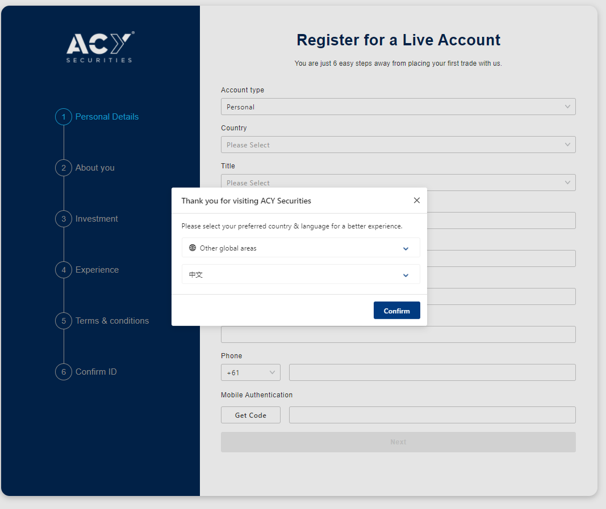
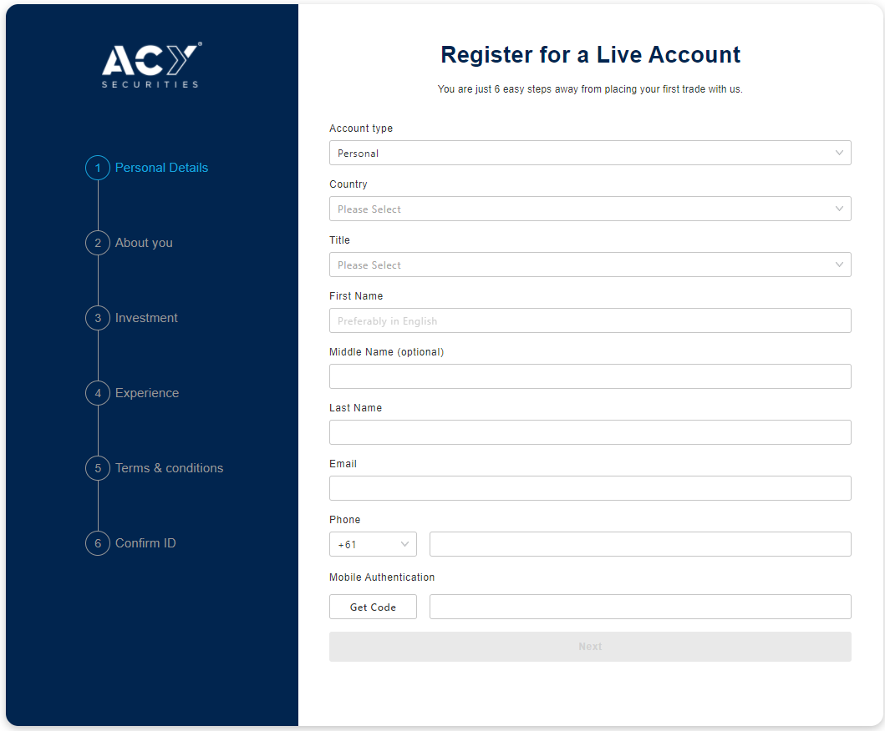

# ACY regyster automation test
Create an automated testing script for "https://www.acy.com/en/open-live-account" register.
Use pytest with selenium to test if we can register ACY successfully or not.

# Structure
### test-acy-register

    │  README.md          │ TestImages folder
    
    │  test_docker folder ├─Locators.py
      
    ├─Locators.py         ├─valid_country.py
    
    ├─main.py             ├─main.py
    
    ├─valid_country.py    └─test_acy_register.py
    
    ├─test_acy_register.py
    
    ├─Dockerfile
    
    ├─docker-compose.yml
    
    └─TestImages folder

### Locators.py
Contains HTML element which used in the test script.
### main.py
Control the browser to stimulate the step to register the user account.
### test_acy_register.py
Contains test case to register the user account.
### valid_country.py
A tool to check those countries that can't register the ACY user account.

# Set up
git clone https://github.com/Andy-CH-BO-AN/test-acy-register.git

cd test-acy-register

pip install -r requirement.txt

pytest test_acy_register.py

## If you have installed docker
git clone https://github.com/Andy-CH-BO-AN/test-acy-register.git

cd test-acy-register

docker-compose build

docker-compose up

# Difference between normal version and docker version

### Select language

Normal version needs to select a language in the beginning of accessing the page:

Docker version doesn't have to select a language:

