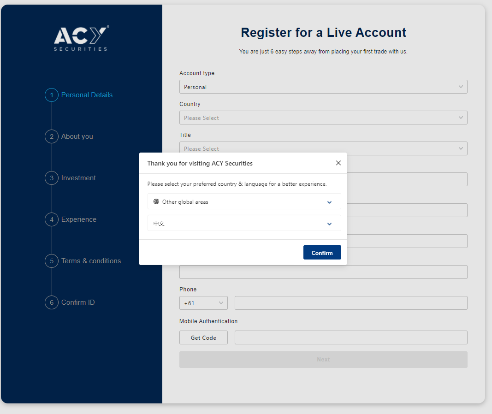
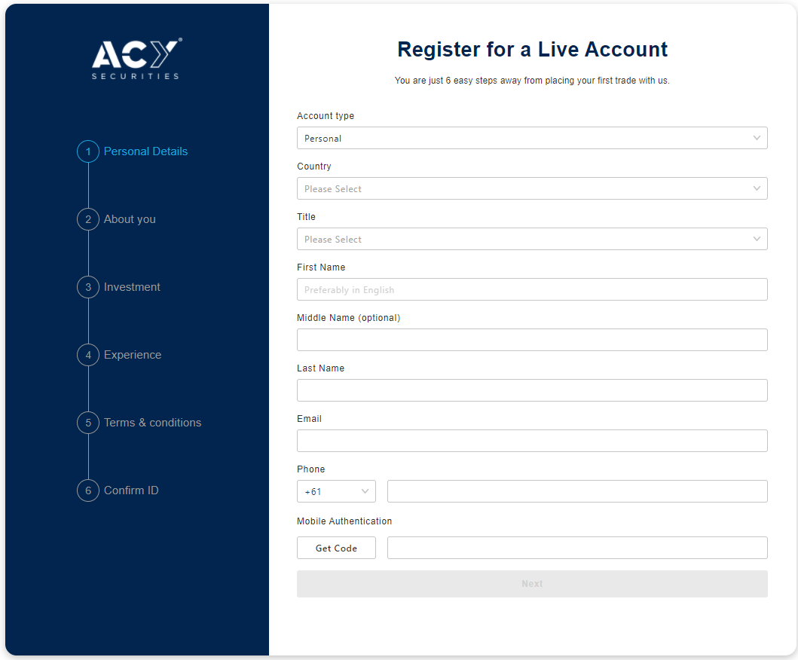

# ACY Registration Automation Test

A small Selenium + pytest project that automates the ACY live-account registration flow.

The project was originally created in 2021 as a browser automation exercise. It drives the registration form end to end, uploads a test image for the identity-document step, and waits for the final success page.

> The target is an external website. Its URL, DOM structure, validation rules, or registration flow may have changed since this project was created, so locators can require maintenance before the test runs successfully today.

## What this project demonstrates

- end-to-end browser automation with Selenium
- pytest-based test execution and browser cleanup
- reusable page-flow methods for a multi-step form
- local Chrome execution with `webdriver-manager`
- remote Chrome execution through Selenium Docker
- a utility for scanning which countries are rejected by the registration form

## Project structure

```text
.
├── GuideImages/             # Screenshots used by this README
├── TestImages/              # Test upload fixtures
├── Dockerfile               # Python test container
├── Locators.py              # UI locators and generated option selectors
├── docker-compose.yml       # Selenium Chrome + test runner
├── main.py                  # Registration flow and WebDriver lifecycle
├── requirements.txt         # Python dependencies
├── test_acy_register.py     # End-to-end pytest case
└── valid_country.py         # Country availability scanner
```

## Registration flow

`test_acy_register.py` exercises the following steps in order:

1. Open the ACY registration page.
2. Fill in personal details.
3. Fill in profile and address information.
4. Select investment preferences.
5. Answer the experience questionnaire.
6. Accept the terms and conditions.
7. Upload test identity documents.
8. Verify that the success page is displayed.

Random values are used for several form choices so repeated runs do not always submit exactly the same data.

## Requirements

For local execution you need:

- Python 3
- Google Chrome
- network access to the ACY registration site

Install the Python dependencies:

```bash
git clone https://github.com/Andy-CH-BO-AN/test-acy-register.git
cd test-acy-register
python -m pip install -r requirements.txt
```

## Run locally

```bash
pytest -q test_acy_register.py
```

The local path creates a Chrome WebDriver through `webdriver-manager` and closes the browser through a pytest fixture even if the test fails.

## Run with Docker

Docker uses the same test code as local execution. Selenium Chrome runs in a separate container and the test runner connects to it with Remote WebDriver.

```bash
docker compose up --build --abort-on-container-exit test_register
```

The Compose configuration sets:

```text
REMOTE_WEBDRIVER_URL=http://selenium:4444/wd/hub
SKIP_LANGUAGE_SELECTION=1
```

Stop and remove the containers after the run with:

```bash
docker compose down
```

## Configuration

The registration runner recognizes these optional environment variables:

| Variable | Purpose |
| --- | --- |
| `ACY_REGISTER_URL` | Override the registration page URL. |
| `REMOTE_WEBDRIVER_URL` | Use a Selenium Remote WebDriver instead of local Chrome. |
| `SKIP_LANGUAGE_SELECTION` | Skip the initial language-selection dialog when set to `1`, `true`, `yes`, or `on`. |

Example:

```bash
ACY_REGISTER_URL=https://example.com/register pytest -q test_acy_register.py
```

## Country availability scanner

`valid_country.py` iterates through the country options and reports entries that trigger the registration error message.

```bash
python valid_country.py
```

It shares the same WebDriver creation and cleanup logic as the main registration test.

## Local and Docker language behavior

The original project observed different initial-page behavior between the normal browser session and Selenium Docker session. Docker therefore skips the language-selection step by default through `SKIP_LANGUAGE_SELECTION=1`.

### Local browser



### Docker browser



## Maintenance notes

Most locators in `Locators.py` are absolute XPath expressions from the original site. They are intentionally kept separate from the registration flow, but absolute XPath is sensitive to page-layout changes.

If the live site has changed, a practical next maintenance step is to replace unstable absolute XPath expressions with durable attributes such as `data-testid`, `name`, `id`, or other semantic selectors where available.
